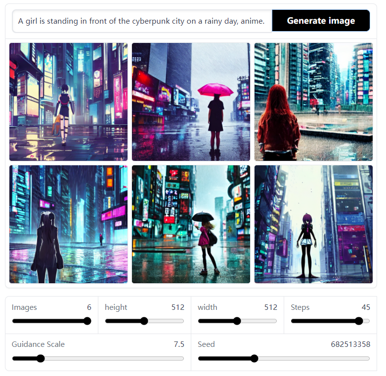

# An Easy Deployment Web Playground of Stable Diffusion Model

This repo provides a web playground which can be easily deployed of stable diffusion model.

Stable diffusion model is a state-of-the-art method for generating images from texts.

There are some platforms (e.g., Huggingface) providing such service for users to play online. However, they often do not provide full custom options for users and thus these models cannot be freely used.

This repo based on Huggingface web demo provide an easy way to deploy your playground and unlock all options for the diffusion model. 




## Requirements

1. Git clone this repo.

2. You need to obtain the auth token from Huggingface to access the pre-trained diffusion model. Please refer [here](https://huggingface.co/CompVis/stable-diffusion#model-access).

3. Ubuntu with cuda supported.

4. Tested on the following python environment:

    ```
    Python==3.8
    cudatoolkit==11.1.1
    diffusers==0.4.1
    fastapi==0.85.0
    gradio @ https://gradio-builds.s3.amazonaws.com/queue-disconnect/v3/gradio-3.4b2-py3-none-any.whl
    huggingface-hub==0.10.0
    Pillow==9.2.0
    torch==1.9.0
    transformers==4.22.2
    ```

    Please install them using conda or pip.

## Launch your playground

**Launch it using:**

```bash
python app.py --test no --device 0 --auth your_auth_token --port 7890 --host 127.0.0.1 
```

Open your browser with ``127.0.0.1:7890``, and have fun.

**Full usage:**

```bash
python app.py -h

usage: app.py [-h] [--test TEST] [--host HOST] [--port PORT] [--device DEVICE] [--auth AUTH]

optional arguments:
  -h, --help       show this help message and exit
  --test TEST      if you are in testing mode, it will not load diffusion model
  --host HOST      specify the ip address
  --port PORT      specify the port
  --device DEVICE  if you have multiple devices, specify it as 0, 1, etc.
  --auth AUTH      fill it with yours in huggingface account to download diffusion model weights
```

If you have any questions, please feel free to have an issue or discussion.

## Reference

[Huggingface/stable-diffusion](https://huggingface.co/spaces/stabilityai/stable-diffusion)

[Reddit/tutorial-to-unlock-stable-diffusion](https://www.reddit.com/r/StableDiffusion/comments/wv2nw0/tutorial_how_to_remove_the_safety_filter_in_5/)

## License

The codes for web playground is under GPLv3 license.

The license for stable diffusion model, please refer [here](https://huggingface.co/spaces/CompVis/stable-diffusion-license).
